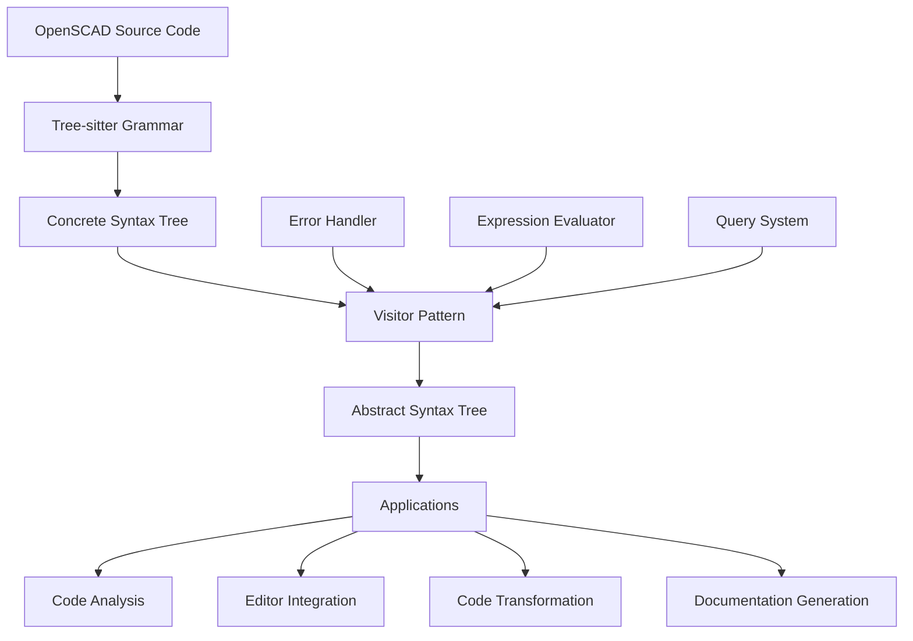

# OpenSCAD Tree-Sitter Parser

A comprehensive monorepo providing robust parsing capabilities for OpenSCAD code using Tree-sitter technology. This project transforms OpenSCAD source code into structured Abstract Syntax Trees (ASTs) with comprehensive error handling and editor integration support.

## 🎯 Project Overview

The OpenSCAD Tree-sitter Parser is a production-ready parsing solution that combines the power of Tree-sitter's incremental parsing with a sophisticated visitor-based AST generation system. It's designed for applications requiring deep understanding of OpenSCAD code structure, including IDEs, code analyzers, formatters, and transformation tools.

### Key Features

- **🚀 High Performance**: Tree-sitter WASM-based parsing with 99.1% test success rate
- **🎯 Comprehensive AST**: Full OpenSCAD language support including modules, functions, expressions, and transformations
- **🔧 Error Handling**: Detailed syntax and semantic error reporting with recovery strategies
- **📝 Editor Integration**: Monaco editor support with syntax highlighting and IntelliSense
- **⚡ Incremental Parsing**: Efficient updates for real-time editor feedback
- **🧩 Extensible Architecture**: Visitor pattern for easy language feature extensions

### Supported OpenSCAD Features

- **Primitives**: `cube()`, `sphere()`, `cylinder()`, `polyhedron()`
- **2D Shapes**: `circle()`, `square()`, `polygon()`, `text()`
- **Transformations**: `translate()`, `rotate()`, `scale()`, `mirror()`, `color()`
- **Boolean Operations**: `union()`, `difference()`, `intersection()`, `minkowski()`
- **Control Structures**: `if/else`, `for` loops, conditional expressions
- **Modules & Functions**: User-defined modules and functions with parameters
- **Expressions**: Arithmetic, logical, comparison, and vector operations
- **Variables**: All OpenSCAD data types including vectors, ranges, and special variables

## 🚀 Quick Start

### For Users (Using the Parser)

```bash
# Install the parser package
npm install@holistic-stack/openscad-parser

# Or with pnpm
pnpm add@holistic-stack/openscad-parser
```

```typescript
import { EnhancedOpenscadParser } from '@openscad/parser';

// Initialize the parser
const parser = new EnhancedOpenscadParser();
await parser.init('./path/to/tree-sitter-openscad.wasm');

// Parse OpenSCAD code
const code = `
  module house(width = 10, height = 15) {
    cube([width, width, height]);
    translate([0, 0, height]) {
      rotate([0, 45, 0]) cube([width*1.4, width, 2]);
    }
  }
  
  house(20, 25);
`;

// Generate AST
const ast = parser.parseAST(code);
console.log(JSON.stringify(ast, null, 2));

// Clean up
parser.dispose();
```

### For Developers (Contributing)

```bash
# Clone the repository
git clone https://github.com/user/openscad-tree-sitter.git
cd openscad-tree-sitter

# Install dependencies (requires Node.js 22+ and PNPM 10+)
pnpm install

# Build all packages
pnpm build

# Run tests
pnpm test

# Start development mode
pnpm dev
```

## 📦 Package Structure

This monorepo contains four main packages:

### [`@openscad/tree-sitter-openscad`](./packages/tree-sitter-openscad)
The core Tree-sitter grammar for OpenSCAD language parsing.
- **Purpose**: Provides the fundamental parsing rules and syntax definitions
- **Output**: Concrete Syntax Tree (CST) from OpenSCAD source code
- **Usage**: Foundation for all other packages

### [`@openscad/parser`](./packages/openscad-parser)
TypeScript parser with AST generation and error handling.
- **Purpose**: Converts CST to semantic AST with comprehensive error reporting
- **Features**: Expression evaluation, visitor pattern, incremental parsing
- **Usage**: Primary package for applications requiring OpenSCAD code analysis

### [`@holistic-stack/openscad-editor`](./packages/openscad-editor)
Monaco editor integration with OpenSCAD language support.
- **Purpose**: Provides rich editing experience with syntax highlighting
- **Features**: IntelliSense, error highlighting, code completion
- **Usage**: Embedding OpenSCAD editors in web applications

### [`@openscad/demo`](./packages/openscad-demo)
Interactive demo application showcasing parser capabilities.
- **Purpose**: Demonstrates real-time parsing and AST visualization
- **Features**: Live code editing, AST explorer, error display
- **Usage**: Testing, learning, and showcasing parser features

## 🛠 Development Workflow

### Testing Strategy

The project follows Test-Driven Development (TDD) with comprehensive test coverage:

```bash
# Run all tests
pnpm test

# Run tests for specific package
pnpm test:parser
pnpm test:grammar
pnpm test:editor

# Run tests in watch mode
pnpm test:watch

# Generate coverage report
pnpm test:coverage
```

### Code Quality

```bash
# Lint all packages
pnpm lint

# Fix linting issues
pnpm lint:fix

# Type checking
pnpm typecheck

# Documentation validation
pnpm docs:validate
```

### Building and Distribution

```bash
# Build all packages
pnpm build

# Build specific package
pnpm build:parser
pnpm build:grammar
pnpm build:editor

# Build grammar with native compilation
pnpm build:grammar:native

# Build grammar for WASM
pnpm build:grammar:wasm
```

## 📚 Documentation

Comprehensive documentation is available in the [`docs/`](./docs) directory:

- **[How-to Guides](./docs/how-to-guides.md)**: Step-by-step tutorials for common tasks
- **[Workflow Examples](./docs/workflow-examples.md)**: Complete development workflows with real code
- **[Best Practices](./docs/best-practices.md)**: Code organization and TypeScript patterns
- **[Do's and Don'ts](./docs/dos-and-donts.md)**: Guidelines and common pitfalls to avoid
- **[TypeScript Guidelines](./docs/typescript-guidelines.md)**: TypeScript best practices for the project
- **[Documentation Workflow](./docs/documentation-workflow.md)**: How to maintain and update documentation

### API Documentation

Each package includes detailed API documentation:

- [Parser API Reference](./packages/openscad-parser/docs/README.md)
- [Grammar Documentation](./packages/tree-sitter-openscad/README.md)
- [Editor Integration Guide](./packages/openscad-editor/README.md)

## 🏗 Architecture

The project follows a layered architecture with clear separation of concerns:



### Design Principles

- **Single Responsibility Principle (SRP)**: Each visitor handles one specific aspect of the language
- **Visitor Pattern**: Extensible architecture for adding new language features
- **Functional Programming**: Immutable data structures and pure functions where possible
- **Error Recovery**: Graceful handling of syntax errors with meaningful error messages
- **Incremental Processing**: Efficient updates for real-time editor integration

## 🤝 Contributing

We welcome contributions! Please see our [Contributing Guidelines](./docs/how-to-guides.md#contributing-to-the-project) for details on:

- Setting up the development environment
- Code style and conventions
- Testing requirements
- Pull request process
- Documentation standards

### Development Environment

**Requirements:**
- Node.js 22.0.0 or higher
- PNPM 10.0.0 or higher
- Git

**Recommended Tools:**
- VS Code with TypeScript and ESLint extensions
- Tree-sitter CLI for grammar development

## 📊 Project Status

- **Test Coverage**: 99.1% individual test success rate (453/457 tests passing)
- **File Coverage**: 97.3% test file success rate (73/75 files passing)
- **Build Status**: All packages building successfully
- **Documentation**: Comprehensive documentation with examples

### Recent Achievements

- ✅ Expression evaluation system with 90% success rate
- ✅ Comprehensive error handling with recovery strategies
- ✅ Monaco editor integration with syntax highlighting
- ✅ Real Tree-sitter integration replacing mock objects
- ✅ Visitor pattern architecture with specialized visitors

## 📄 License

This project is licensed under the MIT License - see the [LICENSE](./LICENSE) file for details.

## 🙏 Acknowledgments

- [Tree-sitter](https://tree-sitter.github.io/) for the powerful parsing framework
- [OpenSCAD](https://openscad.org/) community for the language specification
- [Monaco Editor](https://microsoft.github.io/monaco-editor/) for the editor integration
- All contributors who have helped improve this project

## 🔗 Links

- [OpenSCAD Official Website](https://openscad.org/)
- [Tree-sitter Documentation](https://tree-sitter.github.io/tree-sitter/)
- [Project Issues](https://github.com/user/openscad-tree-sitter/issues)
- [Project Discussions](https://github.com/user/openscad-tree-sitter/discussions)

---

**Made with ❤️ by the OpenSCAD community**