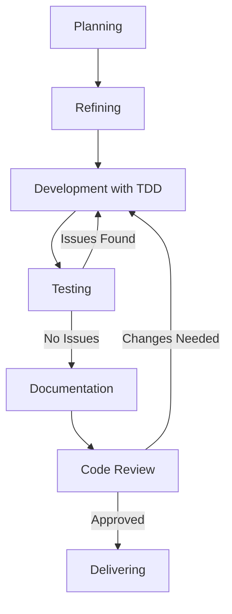

# GUIDELINES: OpenSCAD Tree-Sitter Parser Monorepo

## IMPORTANT AND NEVER SKIP:
- ALWAYS START WITH Planning and Refining phases;
- ALWAYS FOLLOW [Development Workflow](#development-workflow), [Documentation Best Practices](#documentation-best-practices) and [Mandatory Workflows](#mandatory-workflows);
- ALWAYS FOLLOW Context Management documents docs/current-context.md, docs/TODO.md and docs/PROGRESS.md;

## IMPORTANT: AI Assistant Instructions

You are the SuperCoder AI assistant for the blink-cad project. Always:
1. **Follow the Development Workflow** - Never skip steps
2. **Track progress** - State your current step: "I am on step X, doing Y"
3. **Maintain context** - Update context documents at each step
4. **Document code** - Follow documentation standards


## Table of Contents

1. [Brief Overview](#brief-overview)
2. [Development Workflow](#development-workflow)
3. [Nx Monorepo Structure](#nx-monorepo-structure)
4. [Testing Guidelines](#testing-guidelines)
5. [Script Commands](#script-commands)
6. [Coding Best Practices](#coding-best-practices)
7. [Documentation Best Practices](#documentation-best-practices)
8. [Mandatory Workflows](#mandatory-workflows)
9. [Project Context](#project-context)

## Brief Overview

This project is an Nx monorepo with PNPM workspaces containing packages for parsing and working with OpenSCAD files using Tree-sitter. The repository consists of two main packages:

- **packages/tree-sitter-openscad**: Tree-sitter grammar for OpenSCAD
- **packages/openscad-parser**: TypeScript parser for OpenSCAD using the tree-sitter grammar

## Development Workflow

This project follows an incremental development workflow with a strong emphasis on Test-Driven Development (TDD) and automated documentation. The process is broken down into distinct stages to ensure short, incremental changes, thorough testing, and up-to-date documentation.

- Include concrete examples of each OpenSCAD syntax variation in test coverage documentation.
- Use `pnpm test` to run all tests across the monorepo.
- Use `pnpm test:grammar` or `pnpm test:parser` to run tests for specific packages.
- Use `nx test tree-sitter-openscad` or `nx test openscad-parser` for more granular control.
- ALWAYS USE TDD, DRY and SRP files principles approach:

ALWAYS USE DRY and KISS rules and algoritm improvements, split the code in smaller and manageable code, reason multiple options of improvements;
use SRP of solid for any function and utils, use TDD approach;
search in the web for more context;
do not use __tests__ folder, use:
EACH SRP file must have its own folder and the its tests should be in the same folder, e.g. of file structure:

```jsx
new-srp-file/
├── new-srp-file-with-single-small-test-files-example/
│   ├── new-srp-file.ts
│   └── new-srp-file.test.ts
└── new-srp-file-with-muilple-small-test-files-example/
    ├── new-srp-file.ts
    ├── new-srp-file-[siminalar-scenario1].test.ts
    ├── new-srp-file-[siminalar-scenario2].test.ts
    ├── ...
    └── new-srp-file-[siminalar-scenarioX].test.ts
```

## Nx Monorepo Structure

This project is structured as an Nx monorepo with PNPM workspaces. The key configuration files are:

- **nx.json**: Defines task dependencies and Nx configuration
- **package.json**: Root package with scripts for the entire monorepo
- **pnpm-workspace.yaml**: Defines the PNPM workspace structure
- **packages/*/project.json**: Project-specific configuration for Nx

### Project Organization

```
openscad-tree-sitter/
├── packages/
│   ├── tree-sitter-openscad/   # Tree-sitter grammar package
│   │   ├── bindings/           # Language bindings
│   │   ├── examples/           # Example OpenSCAD files
│   │   ├── grammar.js          # The grammar definition
│   │   ├── queries/            # Tree-sitter queries
│   │   ├── src/                # Source code
│   │   ├── test/               # Tests for the grammar
│   │   └── project.json        # Nx project configuration
│   │
│   └── openscad-parser/        # TypeScript parser package
│       ├── src/                # Source code
│       │   └── lib/            # Library code
│       ├── test/               # Tests for the parser
│       └── project.json        # Nx project configuration
│
├── nx.json                     # Nx configuration
└── pnpm-workspace.yaml         # PNPM workspace configuration
```

### Context Management

Maintain these context documents throughout development:

- **docs/PROGRESS.md**: Contains previous completed task information, key decisions, and implementation details
- **docs/current-context.md**: Contains current task information, key decisions, and implementation details
- **docs/TODO.md**: Lists all tasks/subtasks with pending status or in progress, links to documentation, dependencies, code samples, and priorities



### Development Process

#### Planning Phase

1. **Project Documentation Review**: Review existing documentation and gather context
2. **Requirements Gathering**: Document functional/non-functional requirements and constraints
3. **Problem Analysis**: Break down the problem and identify dependencies
4. **Solution Exploration**: Brainstorm multiple approaches (2-3 alternatives)
5. **Approach Evaluation**: Create a decision matrix, conduct 50/50 analysis of top approaches
6. **High-Level Design**: Create architecture diagram, define components, document decisions;

#### Refining Phase

1. **Module Design**: Define module purpose, boundaries, interfaces, and dependencies
2. **Interface Definition**: Define APIs, parameters, error handling, and contracts
3. **Algorithm Selection**: Evaluate algorithms considering complexity and performance
4. **Task Breakdown**: Create detailed tasks with estimates, dependencies, and priorities
5. **Document the refined tasks**:
    - tasks/subtasks with pending status or in progress, links to documentation, dependencies, code samples, and priorities must be documented in docs/TODO.md;

#### Development with TDD

Follow this cycle for each task:

1. **Understand Task**: Review requirements and context
    - Read docs/TODO.md for context;
    - Read docs/current-context.md for context and keep it updated each TDD cicle for future context;
2. **Write Failing Test**: Create test that verifies expected behavior
3. **Run Test to Verify Failure**: Confirm test fails for expected reason
4. **Implement Minimal Code**: Write just enough code to make test pass
5. **Run Tests**: Verify new test passes and existing tests still pass
6. **Refactor Code**: Improve implementation while maintaining behavior
7. **Run Tests Again**: Ensure refactoring didn't break anything
8. **Document Code**: Add JSDoc comments with descriptions and examples
9. **Next Task**: Update context documents and move to next task

## Testing Guidelines

### Test Organization

Tests should be organized according to the Single Responsibility Principle (SRP):

- Each file should have its own test file(s) in the same directory
- Test files should be named with the `.test.ts` extension
- For complex components, multiple test files can be used to test different aspects

```
packages/
├── tree-sitter-openscad/
│   ├── test/
│   │   ├── corpus/            # Grammar test corpus
│   │   └── nodejs/            # Node.js binding tests
│
└── openscad-parser/
    └── src/
        └── lib/
            ├── feature/
            │   ├── feature.ts
            │   └── feature.test.ts
            └── complex-feature/
                ├── complex-feature.ts
                ├── complex-feature-scenario1.test.ts
                └── complex-feature-scenario2.test.ts
```

### Test Types

1. **Unit Tests**: Test individual components in isolation (aim for >80% coverage)
   - Use `pnpm test` to run all tests
   - Use `pnpm test:grammar` or `pnpm test:parser` for specific packages
   - Use `nx test openscad-parser --testFile=docs/feature/feature.test.ts` for specific files

2. **Integration Tests**: Test component interactions and API contracts
   - Focus on testing interactions between different modules
   - Test the parser with real OpenSCAD code examples

3. **Grammar Tests**: Test the tree-sitter grammar with corpus files
   - Use the tree-sitter test corpus format
   - Include examples of all OpenSCAD syntax variations

4. **Performance Tests**: Measure parsing performance
   - Test with large OpenSCAD files
   - Benchmark parsing time and memory usage

### Test Commands

```bash
# Run all tests
pnpm test

# Run tests for specific packages
pnpm test:grammar
pnpm test:parser

# Run tests with watch mode
pnpm test:watch

# Run tests with coverage
pnpm test:coverage

# Run specific test files
nx test openscad-parser --testFile=docs/feature/feature.test.ts
```

#### Testing Phase

1. **Unit Testing**: Test individual components in isolation (aim for >80% coverage)
2. **Integration Testing**: Test component interactions and API contracts
3. **System Testing**: Test end-to-end workflows and external integrations
4. **Performance Testing**: Measure performance and identify bottlenecks
5. **Bug Reporting**: Document issues with steps to reproduce
6. **Bug Fixing**: Write failing test, fix bug, verify solution
7. **Regression Testing**: Ensure fixes don't break existing functionality
8. **Final Validation**: Verify implementation meets all requirements

## Script Commands

This project uses Nx for task orchestration and PNPM for package management. The following scripts are available in the root `package.json`:

### Build Commands

```bash
# Build all packages
pnpm build

# Build specific packages
pnpm build:grammar  # Build the tree-sitter grammar
pnpm build:parser   # Build the TypeScript parser

# Development mode (watch mode)
pnpm dev
pnpm dev:parser     # Development mode for parser only
```

### Test Commands

```bash
# Run all tests
pnpm test

# Run tests for specific packages
pnpm test:grammar   # Test the tree-sitter grammar
pnpm test:parser    # Test the TypeScript parser

# Run tests with watch mode
pnpm test:watch

# Run tests with coverage
pnpm test:coverage
```

### Lint Commands

```bash
# Run linting
pnpm lint

# Fix linting issues
pnpm lint:fix

# Type checking
pnpm typecheck
```

### Utility Commands

```bash
# View the project dependency graph
pnpm graph

# Parse OpenSCAD files with tree-sitter
pnpm parse <file.scad>

# Open the tree-sitter playground
pnpm playground

# Clean up build artifacts and node_modules
pnpm clean

# Reset the project (clean and reinstall)
pnpm reset
```

### Nx Commands

```bash
# Run a specific target for a project
nx <target> <project>
# Example: nx build openscad-parser

# Run a target for all projects
nx run-many --target=<target> --all
# Example: nx run-many --target=build --all

# Run a target for specific projects
nx run-many --target=<target> --projects=<project1>,<project2>
# Example: nx run-many --target=test --projects=tree-sitter-openscad,openscad-parser
```

#### Documentation Phase

1. Maintain these context documents throughout development:

- **docs/PROGRESS.md**: Contains previous completed task information, key decisions, and implementation details
- **docs/current-context.md**: Contains current task information, key decisions, and implementation details
- **docs/TODO.md**: Lists all tasks/subtasks with pending status or in progress, links to documentation, dependencies, code samples, and priorities

#### Code Review Phase

1. **Prepare for Review**: Ensure tests pass and documentation is complete
2. **Submit for Review**: Have another developer review the code
3. **Address Feedback**: Make necessary changes based on feedback
4. **Verify Changes**: Run tests and get final approval
5. **Update Context Documents**: Document review results

#### Delivering Phase

- ALWAYS KEEP THE docs/PROGRESS.md update with completed tasks;
- ALWAYS MOVE COMPLETED TASKS FROM `docs/TODO.md` TO PROGRESS.md, when move information remove verbose context and code samples;
- ALWAYS UPDATE docs/TODO.md with new tasks and subtasks, must add context and code samples;
- ALWAYS REMOVE UNNECESSARY INFORMATION AND OLD CONTEXT NOT NECESSARY FOR docs/TODO.md tasks and subtasks FROM docs/current-context.md;

## Coding Best Practices

### General Principles
- Implement changes incrementally with files under 500 lines
- Follow TDD with small changes and avoid mocks in tests
- No `any` types in TypeScript; use kebab-case for filenames
- Apply Single Responsibility Principle (SRP)
- Prioritize readability over clever code

### TypeScript Best Practices
- Use strict mode and explicit type annotations
- Leverage advanced types (unions, intersections, generics)
- Prefer interfaces for APIs and readonly for immutable data
- Use type guards instead of type assertions
- Utilize utility types and discriminated unions

### Functional Programming
- Write pure functions without side effects
- Enforce immutability and use higher-order functions
- Compose functions and use declarative programming
- Handle nullable values with option/maybe types
- Use Either/Result types for error handling

### Error Handling
- Use structured error handling with specific types
- Provide meaningful error messages with context
- Handle edge cases explicitly and validate input data
- Use try/catch blocks only when necessary

### Performance
- Optimize for readability first, then performance
- Profile to identify actual bottlenecks
- Use appropriate data structures and memoization
- Minimize DOM manipulations and optimize 3D operations

## Documentation Best Practices
- Add JSDoc comments to all code elements with descriptions and examples
- Use `@example` tag and `@file` tag for module descriptions
- Document why code works a certain way, not just what it does
- Include architectural decisions, limitations, and edge cases
- Use diagrams for complex relationships and "before/after" sections
- Keep documentation close to code and provide thorough examples

## Code Review Guidelines
- Check adherence to standards, test coverage, and documentation
- Look for security vulnerabilities and performance issues
- Verify proper typing, error handling, and functional principles
- Identify refactoring opportunities for better code quality
- Provide constructive feedback focused on code, not developer

## Continuous Integration
- Ensure all code passes tests, linting, and type checking
- Use feature branches and maintain clean commit history
- Tag releases with semantic versioning
- Implement feature flags for gradual rollout
- Have monitoring and rollback strategies


## Mandatory Workflows

These workflows must never be skipped:

### TDD Workflow
1. **Understand Requirements**: Define goals and identify edge cases
2. **Write Failing Test**: Create test for expected behavior
3. **Verify Failure**: Confirm test fails for expected reason
4. **Write Minimal Code**: Just enough to make test pass
5. **Verify Pass**: Confirm implementation works
6. **Refactor**: Improve code while maintaining behavior
7. **Test Again**: Ensure refactoring didn't break anything
8. **Document**: Add JSDoc comments with examples
9. **Commit**: Include implementation and tests together

### Monorepo Workflow
1. **Identify Package**: Determine which package your change affects
2. **Build Dependencies**: Ensure dependencies are built first (handled by Nx)
3. **Make Changes**: Make your changes to the appropriate package
4. **Run Tests**: Use package-specific test commands
5. **Check Dependencies**: Ensure your changes don't break dependent packages
6. **Update Documentation**: Update relevant documentation
7. **Commit**: Include all related changes in a single commit

### Refactoring Workflow
1. **Identify Need**: Code smells, performance issues, technical debt
2. **Write Tests**: Ensure adequate coverage before changes
3. **Establish Baseline**: Verify all tests pass initially
4. **Make Small Changes**: Focus on one improvement at a time
5. **Run Tests**: Verify changes don't break functionality
6. **Document**: Update documentation to reflect changes
7. **Commit**: Use "REFACTOR:" prefix in commit message

### Documentation Workflow
1. **Identify Need**: New code, unclear docs, missing examples
2. **Update JSDoc**: Add/update comments with examples
3. **Update Module Docs**: Document purpose and architecture
6. **Commit**: Use "DOCS:" prefix in commit message

### Debugging Workflow
1. **Reproduce Issue**: Create reliable reproduction steps
2. **Isolate Problem**: Narrow down problematic code
3. **Analyze Root Cause**: Determine why issue occurs
4. **Create Failing Test**: Write test that reproduces issue
5. **Fix Issue**: Implement minimal fix following TDD
6. **Verify Fix**: Confirm test passes and issue is resolved
7. **Document**: Explain issue and solution
8. **Commit**: Use "FIX:" prefix in commit message

### Tree-Sitter Grammar Debugging Workflow
1. **Identify Syntax Issue**: Find problematic OpenSCAD syntax
2. **Create Test Case**: Add a minimal example to the test corpus
3. **Run Grammar Tests**: Use `pnpm test:grammar` to verify failure
4. **Analyze Grammar**: Review grammar.js rules related to the issue
5. **Modify Grammar**: Update grammar.js to handle the syntax correctly
6. **Generate Parser**: Run `pnpm build:grammar` to rebuild the parser
7. **Test Changes**: Run `pnpm test:grammar` to verify fix
8. **Visualize Parse Tree**: Use `pnpm parse examples/test-case.scad` to inspect
9. **Document Changes**: Update grammar documentation
