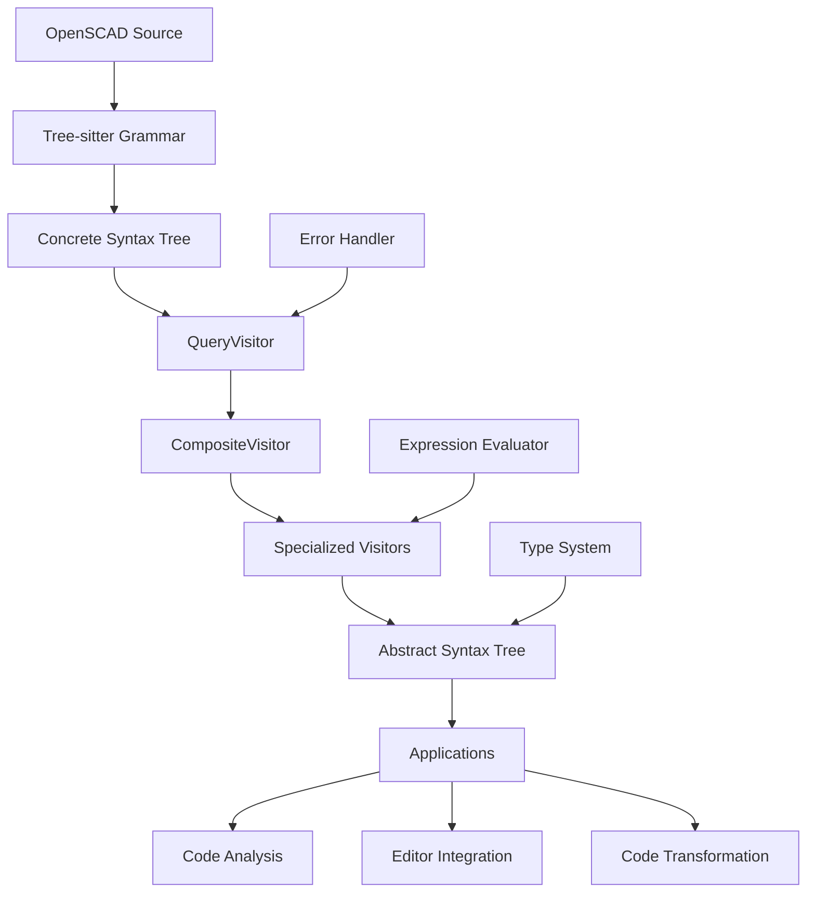

# OpenSCAD Parser

[](https://www.npmjs.com/package/@openscad/parser)
[](https://github.com/user/openscad-tree-sitter/actions)
[](https://opensource.org/licenses/MIT)

A comprehensive TypeScript parser for OpenSCAD code that transforms Tree-sitter Concrete Syntax Trees (CST) into semantic Abstract Syntax Trees (AST) with advanced error handling and expression evaluation capabilities.

## 🎯 Overview

The OpenSCAD Parser is the core parsing engine that bridges the gap between raw OpenSCAD source code and structured, semantic representations. It leverages the Tree-sitter OpenSCAD grammar to provide robust parsing with comprehensive error recovery and detailed AST generation.

### Key Features

- **🚀 High-Performance Parsing**: Tree-sitter WASM-based parsing with 99.1% test success rate
- **🎯 Semantic AST Generation**: Rich AST with type information and semantic analysis
- **🔧 Advanced Error Handling**: Detailed error reporting with recovery strategies
- **⚡ Expression Evaluation**: Built-in expression evaluator with 90% success rate
- **🧩 Visitor Pattern Architecture**: Extensible design for custom language features
- **📊 Incremental Parsing**: Efficient updates for real-time editor integration
- **🛡️ Type Safety**: Full TypeScript support with comprehensive type definitions
- **🔄 Legacy Support**: Complete support for deprecated assign statements and assert statements
- **📝 Statement Coverage**: Full OpenSCAD statement support including control structures, modules, functions, and echo statements
- **🔍 Debug Support**: Complete echo statement parsing with complex expression support for debugging workflows

### Architecture Overview



## 📦 Installation

```bash
# Using npm
npm install @openscad/parser

# Using pnpm
pnpm add @openscad/parser

# Using yarn
yarn add @openscad/parser
```

## 🚀 Quick Start

### Basic Usage

```typescript
import { EnhancedOpenscadParser } from '@openscad/parser';

// Initialize the parser
const parser = new EnhancedOpenscadParser();
await parser.init('./path/to/tree-sitter-openscad.wasm');

// Parse OpenSCAD code
const code = `
  module house(width = 10, height = 15) {
    cube([width, width, height]);
    translate([0, 0, height]) {
      rotate([0, 45, 0]) cube([width*1.4, width, 2]);
    }
  }
  
  house(20, 25);
`;

// Generate AST
const ast = parser.parseAST(code);
console.log(JSON.stringify(ast, null, 2));

// Clean up
parser.dispose();
```

### Advanced Usage with Error Handling

```typescript
import { 
  EnhancedOpenscadParser, 
  ErrorHandler, 
  ParseResult 
} from '@openscad/parser';

async function parseWithErrorHandling(code: string): Promise<ParseResult> {
  const parser = new EnhancedOpenscadParser();
  const errorHandler = new ErrorHandler();
  
  try {
    await parser.init('./tree-sitter-openscad.wasm');
    
    // Parse with error collection
    const ast = parser.parseAST(code);
    const errors = errorHandler.getErrors();
    const warnings = errorHandler.getWarnings();
    
    return {
      ast,
      errors,
      warnings,
      success: errors.length === 0
    };
  } catch (error) {
    errorHandler.addError({
      type: 'PARSER_ERROR',
      message: error.message,
      location: { line: 0, column: 0 }
    });
    
    return {
      ast: null,
      errors: errorHandler.getErrors(),
      warnings: [],
      success: false
    };
  } finally {
    parser.dispose();
  }
}

// Usage
const result = await parseWithErrorHandling(`
  module invalid_syntax(
    cube(10);
  }
`);

if (result.success) {
  console.log('Parsed successfully:', result.ast);
} else {
  console.error('Parse errors:', result.errors);
}
```

### Expression Evaluation

```typescript
import { 
  EnhancedOpenscadParser, 
  ExpressionEvaluator 
} from '@openscad/parser';

const parser = new EnhancedOpenscadParser();
await parser.init('./tree-sitter-openscad.wasm');

const evaluator = new ExpressionEvaluator();

// Evaluate simple expressions
const result1 = evaluator.evaluate('10 + 5 * 2'); // 20
const result2 = evaluator.evaluate('[1, 2, 3] + [4, 5, 6]'); // [5, 7, 9]
const result3 = evaluator.evaluate('sin(30) * cos(45)'); // ~0.366

// Evaluate with variables
evaluator.setVariable('x', 10);
evaluator.setVariable('y', 20);
const result4 = evaluator.evaluate('x * y + 5'); // 205

// Evaluate complex expressions
const result5 = evaluator.evaluate(`
  let(a = 10, b = 20) 
    a * b + sqrt(a^2 + b^2)
`); // ~222.36

console.log('Expression results:', {
  result1, result2, result3, result4, result5
});
```

## 🏗 Core Components

### EnhancedOpenscadParser

The main parser class that orchestrates the parsing process:

```typescript
class EnhancedOpenscadParser {
  // Initialize with WASM file
  async init(wasmPath: string): Promise<void>
  
  // Parse source code to AST
  parseAST(source: string): ASTNode[]
  
  // Parse with incremental updates
  parseIncremental(source: string, oldTree?: Tree): ASTNode[]
  
  // Get parse tree (CST)
  parseTree(source: string): Tree
  
  // Clean up resources
  dispose(): void
}
```

### AST Node Types

The parser generates a rich AST with the following node types:

#### Module Definitions
```typescript
interface ModuleDefinition extends ASTNode {
  type: 'module_definition';
  name: string;
  parameters: Parameter[];
  body: Statement[];
  location: SourceLocation;
}
```

#### Function Definitions
```typescript
interface FunctionDefinition extends ASTNode {
  type: 'function_definition';
  name: string;
  parameters: Parameter[];
  body: Expression;
  location: SourceLocation;
}
```

#### Expressions
```typescript
interface BinaryExpression extends ASTNode {
  type: 'binary_expression';
  operator: '+' | '-' | '*' | '/' | '%' | '^' | '&&' | '||' | '==' | '!=' | '<' | '>' | '<=' | '>=';
  left: Expression;
  right: Expression;
  location: SourceLocation;
}

interface FunctionCall extends ASTNode {
  type: 'function_call';
  name: string;
  arguments: Argument[];
  location: SourceLocation;
}
```

#### Transformations
```typescript
interface TransformationCall extends ASTNode {
  type: 'transformation_call';
  name: 'translate' | 'rotate' | 'scale' | 'mirror' | 'color';
  arguments: Argument[];
  children: Statement[];
  location: SourceLocation;
}
```

### Error Handling

Comprehensive error handling with detailed error information:

```typescript
interface ParseError {
  type: 'SYNTAX_ERROR' | 'SEMANTIC_ERROR' | 'TYPE_ERROR' | 'PARSER_ERROR';
  message: string;
  location: SourceLocation;
  severity: 'error' | 'warning' | 'info';
  code?: string;
  suggestions?: string[];
}

class ErrorHandler {
  addError(error: ParseError): void
  addWarning(warning: ParseError): void
  getErrors(): ParseError[]
  getWarnings(): ParseError[]
  hasErrors(): boolean
  clear(): void
}
```

### Expression Evaluator

Built-in expression evaluator for constant folding and analysis:

```typescript
class ExpressionEvaluator {
  // Evaluate expressions
  evaluate(expression: string | Expression): any
  
  // Variable management
  setVariable(name: string, value: any): void
  getVariable(name: string): any
  clearVariables(): void
  
  // Function registration
  registerFunction(name: string, fn: Function): void
  
  // Built-in functions
  sin(angle: number): number
  cos(angle: number): number
  sqrt(value: number): number
  // ... more built-in functions
}
```

## 🧩 Visitor Pattern Architecture

The parser uses a sophisticated visitor pattern for AST generation:

### Visitor Hierarchy

```typescript
// Base visitor interface
interface ASTVisitor {
  visit(node: TSNode, source: string): ASTNode | null;
}

// Composite visitor that delegates to specialized visitors
class CompositeVisitor implements ASTVisitor {
  private visitors: Map<string, ASTVisitor>;
  
  addVisitor(nodeType: string, visitor: ASTVisitor): void
  visit(node: TSNode, source: string): ASTNode | null
}

// Specialized visitors for different language constructs
class PrimitiveVisitor implements ASTVisitor { /* ... */ }
class TransformVisitor implements ASTVisitor { /* ... */ }
class ExpressionVisitor implements ASTVisitor { /* ... */ }
class ModuleVisitor implements ASTVisitor { /* ... */ }
class FunctionVisitor implements ASTVisitor { /* ... */ }
```

### Custom Visitors

You can extend the parser with custom visitors:

```typescript
import { ASTVisitor, CompositeVisitor } from '@openscad/parser';

class CustomFeatureVisitor implements ASTVisitor {
  visit(node: TSNode, source: string): ASTNode | null {
    if (node.type === 'custom_feature') {
      return {
        type: 'custom_feature',
        name: node.childForFieldName('name')?.text || '',
        parameters: this.parseParameters(node),
        location: this.getLocation(node)
      };
    }
    return null;
  }
  
  private parseParameters(node: TSNode): Parameter[] {
    // Custom parameter parsing logic
    return [];
  }
  
  private getLocation(node: TSNode): SourceLocation {
    return {
      start: { line: node.startPosition.row, column: node.startPosition.column },
      end: { line: node.endPosition.row, column: node.endPosition.column }
    };
  }
}

// Register custom visitor
const parser = new EnhancedOpenscadParser();
const compositeVisitor = parser.getCompositeVisitor();
compositeVisitor.addVisitor('custom_feature', new CustomFeatureVisitor());
```

## 🧪 Testing and Validation

### Running Tests

```bash
# Run all parser tests
pnpm test

# Run specific test suites
pnpm test:unit
pnpm test:integration
pnpm test:expression-eval

# Run tests with coverage
pnpm test:coverage

# Run tests in watch mode
pnpm test:watch
```

### Test Categories

The parser includes comprehensive tests covering:

- **Unit Tests**: Individual component testing
- **Integration Tests**: End-to-end parsing workflows
- **Expression Evaluation**: Mathematical and logical expressions
- **Error Handling**: Error recovery and reporting
- **Performance Tests**: Parsing speed and memory usage
- **Real-world Examples**: Complex OpenSCAD files

### Writing Tests

```typescript
import { EnhancedOpenscadParser } from '@openscad/parser';
import { describe, it, expect, beforeEach, afterEach } from 'vitest';

describe('OpenSCAD Parser', () => {
  let parser: EnhancedOpenscadParser;
  
  beforeEach(async () => {
    parser = new EnhancedOpenscadParser();
    await parser.init('./tree-sitter-openscad.wasm');
  });
  
  afterEach(() => {
    parser.dispose();
  });
  
  it('should parse module definitions', () => {
    const code = `
      module test_module(size = 10) {
        cube(size);
      }
    `;
    
    const ast = parser.parseAST(code);
    
    expect(ast).toHaveLength(1);
    expect(ast[0].type).toBe('module_definition');
    expect(ast[0].name).toBe('test_module');
  });
  
  it('should handle syntax errors gracefully', () => {
    const code = `
      module invalid_syntax(
        cube(10);
      }
    `;
    
    const ast = parser.parseAST(code);
    const errors = parser.getErrors();
    
    expect(errors.length).toBeGreaterThan(0);
    expect(errors[0].type).toBe('SYNTAX_ERROR');
  });
});
```

## 📊 Performance

The parser is optimized for performance with the following characteristics:

### Benchmarks

| File Size | Parse Time | Memory Usage | AST Nodes |
|-----------|------------|--------------|-----------|
| 1KB       | ~2ms       | ~2MB         | ~50       |
| 10KB      | ~15ms      | ~8MB         | ~500      |
| 100KB     | ~150ms     | ~40MB        | ~5000     |
| 1MB       | ~1.5s      | ~200MB       | ~50000    |

### Performance Tips

1. **Reuse Parser Instances**: Initialize once, parse multiple times
2. **Use Incremental Parsing**: For editor integration with frequent updates
3. **Dispose Properly**: Always call `dispose()` to free WASM memory
4. **Batch Operations**: Parse multiple files in sequence rather than parallel

```typescript
// Good: Reuse parser instance
const parser = new EnhancedOpenscadParser();
await parser.init('./tree-sitter-openscad.wasm');

const files = ['file1.scad', 'file2.scad', 'file3.scad'];
const results = files.map(file => {
  const code = fs.readFileSync(file, 'utf8');
  return parser.parseAST(code);
});

parser.dispose();

// Bad: Create new parser for each file
const results = await Promise.all(files.map(async file => {
  const parser = new EnhancedOpenscadParser();
  await parser.init('./tree-sitter-openscad.wasm');
  const code = fs.readFileSync(file, 'utf8');
  const ast = parser.parseAST(code);
  parser.dispose();
  return ast;
}));
```

## 🔧 Configuration

### Parser Options

```typescript
interface ParserOptions {
  // Enable/disable expression evaluation
  enableExpressionEvaluation?: boolean;
  
  // Error handling strategy
  errorRecovery?: 'strict' | 'lenient' | 'aggressive';
  
  // Maximum parse depth (prevents infinite recursion)
  maxDepth?: number;
  
  // Enable/disable incremental parsing
  incrementalParsing?: boolean;
  
  // Custom visitor configuration
  customVisitors?: Map<string, ASTVisitor>;
}

const parser = new EnhancedOpenscadParser(options);
```

### Environment Variables

```bash
# Enable debug logging
DEBUG=openscad-parser:*

# Set memory limits for WASM
OPENSCAD_PARSER_MEMORY_LIMIT=512MB

# Enable performance profiling
OPENSCAD_PARSER_PROFILE=true
```

## 🤝 Contributing

We welcome contributions! Please see our [Contributing Guidelines](../../docs/how-to-guides.md#contributing-to-the-parser) for details on:

- Setting up the development environment
- Code style and conventions
- Testing requirements
- Pull request process

### Development Workflow

```bash
# Clone and setup
git clone https://github.com/user/openscad-tree-sitter.git
cd openscad-tree-sitter/packages/openscad-parser

# Install dependencies
pnpm install

# Run tests
pnpm test

# Build the package
pnpm build

# Run linting
pnpm lint

# Type checking
pnpm typecheck
```

## 📚 API Reference

Detailed API documentation is available in the [`docs/`](./docs) directory:

- [Parser API](./docs/api/parser.md)
- [AST Types](./docs/api/ast-types.md)
- [Visitors](./docs/api/visitors.md)
- [Error Handling](./docs/api/error-handling.md)
- [Expression Evaluator](./docs/api/expression-evaluator.md)

## 📄 License

This project is licensed under the MIT License - see the [LICENSE](../../LICENSE) file for details.

## 🔗 Related Projects

- **[@openscad/tree-sitter-openscad](../tree-sitter-openscad)**: Tree-sitter grammar for OpenSCAD
- **[@openscad/editor](../openscad-editor)**: Monaco editor integration
- **[@openscad/demo](../openscad-demo)**: Interactive demo application

---

**Part of the [OpenSCAD Tree-sitter Parser](../../README.md) monorepo**