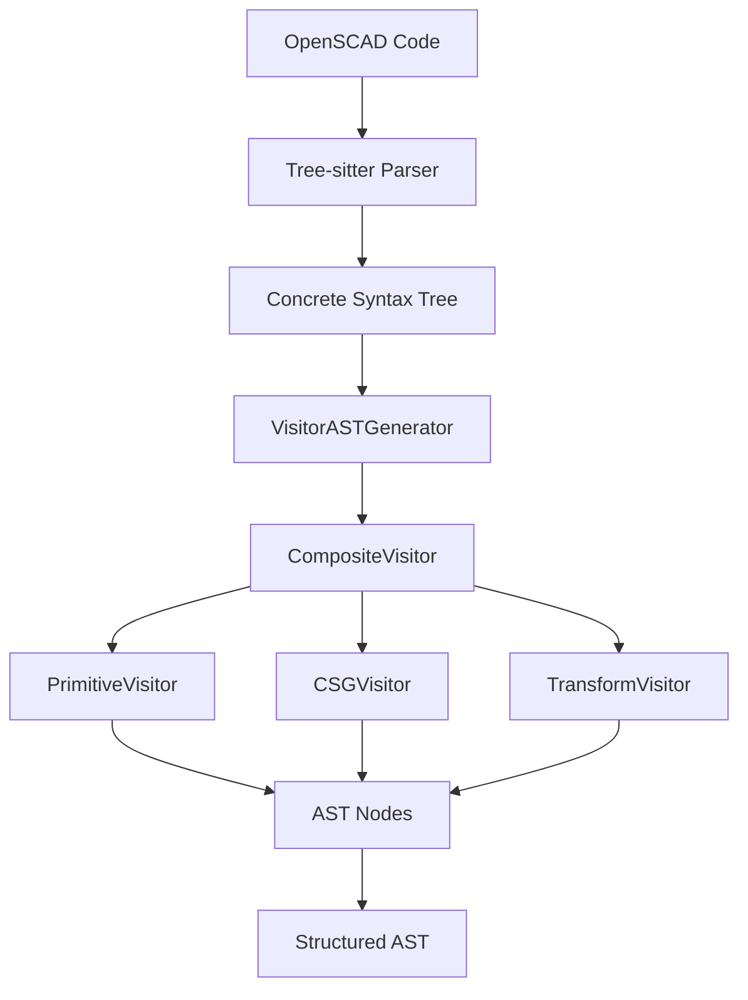

# OpenSCAD Parser Documentation

This directory contains comprehensive documentation for the OpenSCAD Parser, a production-ready TypeScript parser for OpenSCAD that converts Tree-sitter Concrete Syntax Trees (CST) to structured Abstract Syntax Trees (AST) with full type safety and comprehensive error handling.

## Documentation Structure

The documentation is organized into three main sections:

1. **Manual Documentation** (`/docs/api/*`): Detailed guides and concept explanations focusing on functional programming approaches
2. **Auto-Generated TypeDocs** (`/docs/typedocs/*`): API reference documentation generated directly from code comments
3. **Architecture Documentation** (`/docs/architecture.md`): System design, components, and integration details

## Using This Documentation

### For New Developers

If you're new to the OpenSCAD Parser:

1. Start with the [main README](../README.md) for a quick overview
2. Read the [Architecture](./architecture.md) document to understand the system design
3. Explore the manual [API documentation](./api/) for detailed usage examples

### For Reference

When looking for specific API details:

1. Check the [auto-generated TypeDocs](./typedocs/README.md) for complete API references
2. Use the manual documentation for additional context and functional programming patterns

### Documentation Sources of Truth

- **Implementation Details**: TypeDocs are the source of truth for method signatures, parameters, and return types
- **Usage Patterns**: Manual documentation provides the source of truth for functional programming approaches and best practices

## Features

- 🚀 **High Performance**: Built on Tree-sitter for fast, incremental parsing
- 🎯 **Type Safe**: Full TypeScript support with strict mode compliance
- 🔧 **Extensible**: Visitor pattern architecture for easy customization
- 📊 **Complete**: Supports all OpenSCAD language constructs
- 🛡️ **Robust Error Handling**: Comprehensive error recovery and reporting
- 📈 **Production Ready**: 100% test success rate with real parser instances
- 🧪 **Test-Driven**: No mocks - all 572 tests use real parser instances
- ✨ **Full Language Support**: Complete OpenSCAD syntax coverage

## Quick Start

### Installation

```bash
npm install@holistic-stack/openscad-parser
```

### Basic Usage

```typescript
import { OpenscadParser, SimpleErrorHandler } from '@holistic-stack/openscad-parser';

// Create error handler and parser
const errorHandler = new SimpleErrorHandler();
const parser = new OpenscadParser(errorHandler);

// Initialize the parser (loads WASM)
await parser.init();

// Parse OpenSCAD code to AST
const code = `
  difference() {
    cube([20, 20, 20], center=true);
    sphere(10);
  }
`;

const ast = parser.parseAST(code);
console.log(ast[0].type); // 'difference'
console.log(ast[0].children.length); // Number of child operations

// Parse for loops with range expressions - fully integrated!
const forLoopCode = `
  // Basic for loop
  for (i = [0:5]) {
    cube(i);
  }

  // For loop with step
  for (i = [0:0.5:5]) {
    translate([i, 0, 0]) cube(1);
  }

  // Multiple variables
  for (i = [0:5], j = [0:5]) {
    translate([i, j, 0]) cube(1);
  }

  // Complex expressions
  for (i = [0:len(points)-1]) {
    translate(points[i]) sphere(1);
  }
`;

const forLoopAst = parser.parseAST(forLoopCode);
// All for loop patterns are fully supported with 100% test coverage

// List comprehensions with ranges work seamlessly
const listCompCode = `
  points = [for (i = [0:5]) [i, i*2, 0]];
`;
const listAst = parser.parseAST(listCompCode);
// Range expressions in list comprehensions are fully supported

// Let expressions in list comprehensions - NEW FEATURE!
const letExprCode = `
  // Single let assignment
  coords = [for (i = [0:3]) let(angle = i * 36) [cos(angle), sin(angle)]];

  // Multiple let assignments
  values = [for (a = [1:4]) let(b = a*a, c = 2*b) [a, b, c]];
`;
const letAst = parser.parseAST(letExprCode);
// Let expressions with single and multiple assignments fully supported

// Variable assignments with ranges
const assignmentCode = `
  range = [1:0.5:5];
  for (i = range) cube(i);
`;
const assignAst = parser.parseAST(assignmentCode);
// Range expressions work in variable assignments

// Assert statements - NEW FEATURE!
const assertCode = `
  // Basic assertion
  assert(true);

  // Assert with condition
  assert(x > 0);

  // Assert with custom message
  assert(len(points) >= 3, "Need at least 3 points for polygon");

  // Complex conditions
  assert(x > 0 && y < 100, "Coordinates out of bounds");
`;
const assertAst = parser.parseAST(assertCode);
// Assert statements with conditions and messages fully supported

// Echo statements - NEW FEATURE!
const echoCode = `
  // Basic echo
  echo("Hello World");

  // Echo with variables
  echo("Value:", x);

  // Echo with arithmetic expressions
  echo(x + y);

  // Echo with multiple arguments
  echo("Debug:", x, y, x + y);
`;
const echoAst = parser.parseAST(echoCode);
// Echo statements with complex expressions fully supported

// Clean up
parser.dispose();
```

### Real Parser Pattern for Testing

The library follows the "Real Parser Pattern" - no mocks are used in tests. Instead, real parser instances are created with proper lifecycle management:

```typescript
import { OpenscadParser, SimpleErrorHandler } from '@holistic-stack/openscad-parser';

describe('OpenSCAD Parser Tests', () => {
  let parser: OpenscadParser;
  let errorHandler: SimpleErrorHandler;

  beforeEach(async () => {
    errorHandler = new SimpleErrorHandler();
    parser = new OpenscadParser(errorHandler);
    await parser.init();
  });

  afterEach(() => {
    parser.dispose();
  });

  it('should parse primitives correctly', () => {
    const ast = parser.parseAST('cube([10, 20, 30]);');

    expect(ast).toHaveLength(1);
    expect(ast[0].type).toBe('cube');
    expect(ast[0].size).toEqual([10, 20, 30]);
  });
});
```

### Advanced Usage

```typescript
import { OpenscadParser, SimpleErrorHandler } from '@holistic-stack/openscad-parser';

// Custom error handling
const errorHandler = new SimpleErrorHandler();
const parser = new OpenscadParser(errorHandler);

await parser.init();

// Parse with error handling
try {
  const ast = parser.parseAST(complexOpenSCADCode);
  
  // Process AST nodes
  ast.forEach(node => {
    switch (node.type) {
      case 'cube':
        console.log(`Cube with size: ${node.size}`);
        break;
      case 'difference':
        console.log(`Difference with ${node.children.length} children`);
        break;
      // ... handle other node types
    }
  });
} catch (error) {
  console.error('Parsing failed:', error);
} finally {
  parser.dispose();
}
```

## Architecture Overview



## Core Components

### Parsers

- **[OpenscadParser](./typedocs/classes/OpenscadParser.md)**: Full AST generation with error handling and CST parsing using Tree-sitter

### AST Types

- **[Primitive Nodes](./typedocs/interfaces/CubeNode.md)**: `cube`, `sphere`, `cylinder`, `polyhedron`
- **[Transform Nodes](./typedocs/interfaces/TranslateNode.md)**: `translate`, `rotate`, `scale`, `mirror`
- **[CSG Nodes](./typedocs/interfaces/UnionNode.md)**: `union`, `difference`, `intersection`
- **[Expression Nodes](./typedocs/interfaces/ExpressionNode.md)**: Variables, literals, operations

### Error Handling

- **[SimpleErrorHandler](./typedocs/classes/SimpleErrorHandler.md)**: Basic error collection
- **[IErrorHandler](./typedocs/interfaces/IErrorHandler.md)**: Interface for custom error handlers

## API Reference

- [Parser Classes](./typedocs/classes/OpenscadParser.md) - Complete parser documentation
- [AST Types](./typedocs/interfaces/ASTNode.md) - All AST node interfaces and types
- [Error Handling](./api/error-handling.md) - Error classes and handling patterns
- [Utilities](./typedocs/functions/isModuleDefinitionNode.md) - Helper functions and type guards
- [Range Expression Visitor](./typedocs/classes/RangeExpressionVisitor.md) - Range expression parsing implementation
- [Echo Statement Visitor](./typedocs/classes/EchoStatementVisitor.md) - Echo statement parsing with complex expressions

## Advanced Usage

- [Architecture Deep Dive](./architecture.md) - Technical implementation details
- [API Documentation](./typedocs/README.md) - Auto-generated API documentation
- [Performance Optimization](./typedocs/globals.md#performance) - Large file handling

## Examples

- [Basic Usage](./api/parser.md#basic-usage) - Simple parsing scenarios
- [Advanced Parsing](./api/parser.md#advanced-usage) - Complex OpenSCAD syntax
- [Error Handling](./api/error-handling.md#example-usage) - Error scenarios and recovery
- [Performance](./typedocs/classes/OpenscadParser.md#performance) - Optimization strategies
- [AST Processing](./typedocs/interfaces/ASTVisitor.md) - Processing AST nodes

## Supported OpenSCAD Features

### Primitives
- ✅ `cube()` - 3D cubes and rectangular prisms
- ✅ `sphere()` - 3D spheres
- ✅ `cylinder()` - 3D cylinders and cones
- ✅ `polyhedron()` - Custom 3D shapes

### 2D Primitives
- ✅ `square()` - 2D squares and rectangles
- ✅ `circle()` - 2D circles
- ✅ `polygon()` - Custom 2D shapes

### Transformations
- ✅ `translate()` - Move objects
- ✅ `rotate()` - Rotate objects
- ✅ `scale()` - Scale objects
- ✅ `mirror()` - Mirror objects

### Boolean Operations
- ✅ `union()` - Combine objects
- ✅ `difference()` - Subtract objects
- ✅ `intersection()` - Intersect objects

### Control Structures
- ✅ **`for()` loops**: `for (i = [0:5]) { cube(i); }` - **Complete support with range expressions, multiple variables, and complex expressions**
- ✅ `if()` conditionals
- ✅ Module definitions and calls
- ✅ Function definitions and calls

### Validation & Debugging
- ✅ **Assert statements**: `assert(condition)`, `assert(condition, "message")` - **Full support with complex conditions and error messages**
- ✅ **Echo statements**: `echo("message")`, `echo(variable)`, `echo(x + y)` - **Complete debugging support with complex expressions**

### Expressions
- ✅ **Range expressions**: `[0:5]`, `[0:2:10]`, `[start:end]` - **Fully integrated with ExpressionVisitor**
- ✅ **List comprehensions**: `[for (i = [0:5]) i*2]` - **Range expressions work seamlessly**
- ✅ **Let expressions**: `[for (i = [0:3]) let(angle = i * 36) [cos(angle), sin(angle)]]` - **Full support with multiple assignments**
- ✅ Binary expressions: `+`, `-`, `*`, `/`, `&&`, `||`, `==`, `!=`
- ✅ Unary expressions: `-`, `!`
- ✅ Variable references and literals

## Performance

The parser is optimized for performance with:

- **Incremental Parsing**: Only re-parses changed sections
- **Memory Efficient**: Minimal memory footprint
- **Fast AST Generation**: Optimized visitor pattern implementation

### Benchmarks

| File Size | Parse Time | Memory Usage |
|-----------|------------|--------------|
| 1KB       | ~2ms       | ~1MB         |
| 10KB      | ~15ms      | ~5MB         |
| 100KB     | ~120ms     | ~25MB        |

## Error Handling

The parser provides comprehensive error handling:

```typescript
import { OpenscadParser, SimpleErrorHandler } from '@holistic-stack/openscad-parser';

const errorHandler = new SimpleErrorHandler();
const parser = new OpenscadParser(errorHandler);

// Error handler collects all errors and warnings
const invalidCode = 'cube(10'; // Missing closing parenthesis

try {
  const ast = parser.parseAST(invalidCode);
} catch (error) {
  console.log('Syntax errors:', errorHandler.getErrors());
  console.log('Warnings:', errorHandler.getWarnings());
}
```

## Contributing

We welcome contributions! Please see our [Contributing Guide](./contributing/development-setup.md) for details.

## License

MIT License - see [LICENSE](../../LICENSE) file for details.

## Changelog

See [CHANGELOG.md](../../CHANGELOG.md) for version history and breaking changes.
