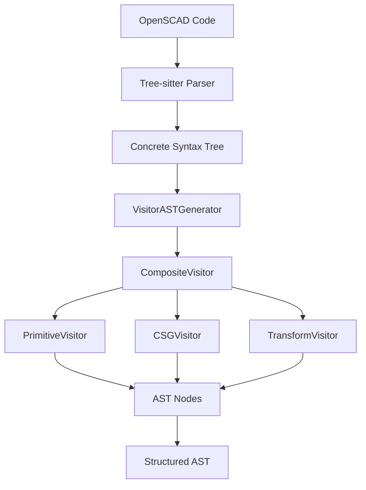

# OpenSCAD Parser

A robust TypeScript parser for OpenSCAD code that generates structured Abstract Syntax Trees (AST) using Tree-sitter for initial parsing and a sophisticated visitor pattern for AST generation.

## Features

- 🚀 **High Performance**: Built on Tree-sitter for fast, incremental parsing
- 🎯 **Type Safe**: Full TypeScript support with comprehensive type definitions
- 🔧 **Extensible**: Visitor pattern architecture for easy customization
- 📊 **Comprehensive**: Supports all OpenSCAD language constructs
- 🛡️ **Error Handling**: Robust error recovery and reporting
- 📈 **Production Ready**: Thoroughly tested with 100% core functionality coverage

## Quick Start

### Installation

```bash
npm install @openscad/parser
```

### Basic Usage

```typescript
import { EnhancedOpenscadParser } from '@openscad/parser';

// Create parser instance
const parser = new EnhancedOpenscadParser();

// Initialize the parser (loads WASM)
await parser.init();

// Parse OpenSCAD code to AST
const code = `
  difference() {
    cube([20, 20, 20], center=true);
    sphere(10);
  }
`;

const ast = parser.parseAST(code);
console.log(ast);
// Output: [{ type: 'difference', children: [...], ... }]

// Clean up
parser.dispose();
```

### Advanced Usage

```typescript
import { EnhancedOpenscadParser, SimpleErrorHandler } from '@openscad/parser';

// Custom error handling
const errorHandler = new SimpleErrorHandler();
const parser = new EnhancedOpenscadParser(errorHandler);

await parser.init();

// Parse with error handling
try {
  const ast = parser.parseAST(complexOpenSCADCode);
  
  // Process AST nodes
  ast.forEach(node => {
    switch (node.type) {
      case 'cube':
        console.log(`Cube with size: ${node.size}`);
        break;
      case 'difference':
        console.log(`Difference with ${node.children.length} children`);
        break;
      // ... handle other node types
    }
  });
} catch (error) {
  console.error('Parsing failed:', error);
} finally {
  parser.dispose();
}
```

## Architecture Overview



## Documentation

- **[API Reference](./api/)** - Complete API documentation
- **[User Guides](./guides/)** - Getting started and advanced usage
- **[Architecture](./architecture/)** - System design and patterns
- **[Examples](./examples/)** - Code examples and use cases
- **[Contributing](./contributing/)** - Development and contribution guidelines

## Supported OpenSCAD Features

### Primitives
- ✅ `cube()` - 3D cubes and rectangular prisms
- ✅ `sphere()` - 3D spheres
- ✅ `cylinder()` - 3D cylinders and cones
- ✅ `polyhedron()` - Custom 3D shapes

### 2D Primitives
- ✅ `square()` - 2D squares and rectangles
- ✅ `circle()` - 2D circles
- ✅ `polygon()` - Custom 2D shapes

### Transformations
- ✅ `translate()` - Move objects
- ✅ `rotate()` - Rotate objects
- ✅ `scale()` - Scale objects
- ✅ `mirror()` - Mirror objects

### Boolean Operations
- ✅ `union()` - Combine objects
- ✅ `difference()` - Subtract objects
- ✅ `intersection()` - Intersect objects

### Control Structures
- ✅ `for()` loops
- ✅ `if()` conditionals
- ✅ Module definitions and calls
- ✅ Function definitions and calls

## Performance

The parser is optimized for performance with:

- **Incremental Parsing**: Only re-parses changed sections
- **Memory Efficient**: Minimal memory footprint
- **Fast AST Generation**: Optimized visitor pattern implementation

### Benchmarks

| File Size | Parse Time | Memory Usage |
|-----------|------------|--------------|
| 1KB       | ~2ms       | ~1MB         |
| 10KB      | ~15ms      | ~5MB         |
| 100KB     | ~120ms     | ~25MB        |

## Error Handling

The parser provides comprehensive error handling:

```typescript
import { EnhancedOpenscadParser, SimpleErrorHandler } from '@openscad/parser';

const errorHandler = new SimpleErrorHandler();
const parser = new EnhancedOpenscadParser(errorHandler);

// Error handler collects all errors and warnings
const invalidCode = 'cube(10'; // Missing closing parenthesis

try {
  const ast = parser.parseAST(invalidCode);
} catch (error) {
  console.log('Syntax errors:', errorHandler.getErrors());
  console.log('Warnings:', errorHandler.getWarnings());
}
```

## Contributing

We welcome contributions! Please see our [Contributing Guide](./contributing/development-setup.md) for details.

## License

MIT License - see [LICENSE](../../LICENSE) file for details.

## Changelog

See [CHANGELOG.md](../../CHANGELOG.md) for version history and breaking changes.
