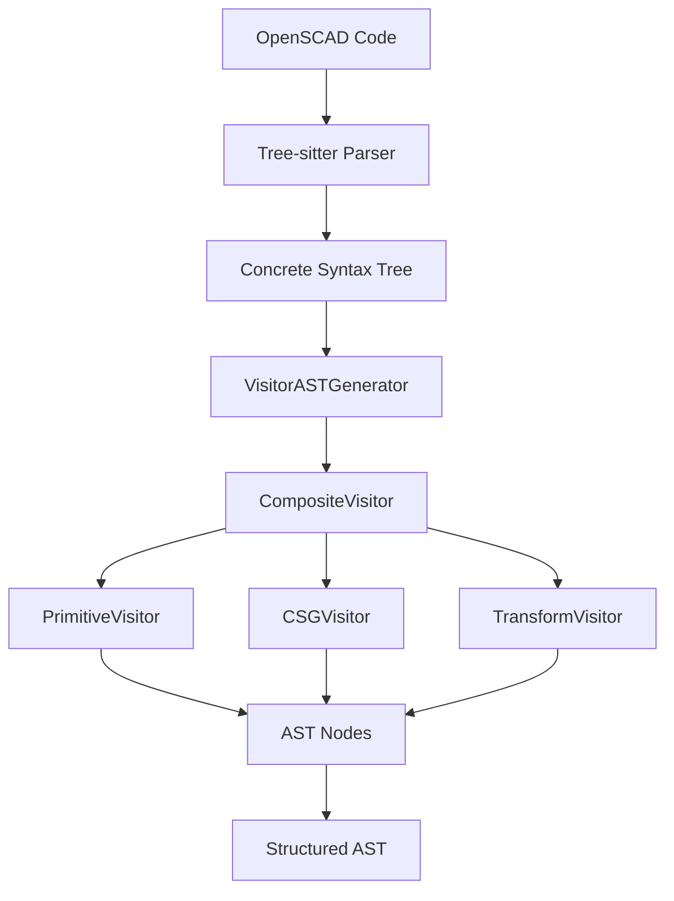

# OpenSCAD Parser

A comprehensive TypeScript parser for OpenSCAD that converts Tree-sitter Concrete Syntax Trees (CST) to structured Abstract Syntax Trees (AST) with full type safety and error handling.

## Overview

The OpenSCAD Parser is part of the OpenSCAD Tree-sitter monorepo and provides sophisticated parsing capabilities for OpenSCAD code. It follows a layered architecture:

1. **Tree-sitter Layer**: Low-level syntax parsing using the `tree-sitter-openscad` grammar
2. **Visitor Pattern Layer**: Converts CST to structured AST using specialized visitors
3. **Error Handling Layer**: Comprehensive error reporting and recovery mechanisms

## Features

- 🚀 **High Performance**: Built on Tree-sitter for fast, incremental parsing
- 🎯 **Type Safe**: Full TypeScript support with comprehensive type definitions
- 🔧 **Extensible**: Visitor pattern architecture for easy customization
- 📊 **Comprehensive**: Supports all OpenSCAD language constructs
- 🛡️ **Error Handling**: Robust error recovery and reporting
- 📈 **Production Ready**: Thoroughly tested with Real Parser Pattern
- 🧪 **Test-Driven**: No mocks - all tests use real parser instances
- ✨ **Range Expression Integration**: Seamless range expression support in all contexts

## Quick Start

### Installation

```bash
npm install @openscad/parser
```

### Basic Usage

```typescript
import { EnhancedOpenscadParser, SimpleErrorHandler } from '@openscad/parser';

// Create error handler and parser
const errorHandler = new SimpleErrorHandler();
const parser = new EnhancedOpenscadParser(errorHandler);

// Initialize the parser (loads WASM)
await parser.init();

// Parse OpenSCAD code to AST
const code = `
  difference() {
    cube([20, 20, 20], center=true);
    sphere(10);
  }
`;

const ast = parser.parseAST(code);
console.log(ast[0].type); // 'difference'
console.log(ast[0].children.length); // Number of child operations

// Parse range expressions - fully integrated in context!
const rangeCode = `
  for (i = [0:2:10]) {
    translate([i, 0, 0]) cube(1);
  }
`;

const rangeAst = parser.parseAST(rangeCode);
// Range [0:2:10] is parsed as RangeExpressionNode with proper integration

// List comprehensions with ranges work seamlessly
const listCompCode = `
  points = [for (i = [0:5]) [i, i*2, 0]];
`;
const listAst = parser.parseAST(listCompCode);
// Range expressions in list comprehensions are fully supported

// Let expressions in list comprehensions - NEW FEATURE!
const letExprCode = `
  // Single let assignment
  coords = [for (i = [0:3]) let(angle = i * 36) [cos(angle), sin(angle)]];

  // Multiple let assignments
  values = [for (a = [1:4]) let(b = a*a, c = 2*b) [a, b, c]];
`;
const letAst = parser.parseAST(letExprCode);
// Let expressions with single and multiple assignments fully supported

// Variable assignments with ranges
const assignmentCode = `
  range = [1:0.5:5];
  for (i = range) cube(i);
`;
const assignAst = parser.parseAST(assignmentCode);
// Range expressions work in variable assignments

// Clean up
parser.dispose();
```

### Real Parser Pattern for Testing

The library follows the "Real Parser Pattern" - no mocks are used in tests. Instead, real parser instances are created with proper lifecycle management:

```typescript
import { EnhancedOpenscadParser, SimpleErrorHandler } from '@openscad/parser';

describe('OpenSCAD Parser Tests', () => {
  let parser: EnhancedOpenscadParser;
  let errorHandler: SimpleErrorHandler;

  beforeEach(async () => {
    errorHandler = new SimpleErrorHandler();
    parser = new EnhancedOpenscadParser(errorHandler);
    await parser.init();
  });

  afterEach(() => {
    parser.dispose();
  });

  it('should parse primitives correctly', () => {
    const ast = parser.parseAST('cube([10, 20, 30]);');

    expect(ast).toHaveLength(1);
    expect(ast[0].type).toBe('cube');
    expect(ast[0].size).toEqual([10, 20, 30]);
  });
});
```

### Advanced Usage

```typescript
import { EnhancedOpenscadParser, SimpleErrorHandler } from '@openscad/parser';

// Custom error handling
const errorHandler = new SimpleErrorHandler();
const parser = new EnhancedOpenscadParser(errorHandler);

await parser.init();

// Parse with error handling
try {
  const ast = parser.parseAST(complexOpenSCADCode);
  
  // Process AST nodes
  ast.forEach(node => {
    switch (node.type) {
      case 'cube':
        console.log(`Cube with size: ${node.size}`);
        break;
      case 'difference':
        console.log(`Difference with ${node.children.length} children`);
        break;
      // ... handle other node types
    }
  });
} catch (error) {
  console.error('Parsing failed:', error);
} finally {
  parser.dispose();
}
```

## Architecture Overview



## Core Components

### Parsers

- **[OpenscadParser](./api/parser.md#openscadparser)**: Basic CST parsing using Tree-sitter
- **[EnhancedOpenscadParser](./api/parser.md#enhancedopenscadparser)**: Full AST generation with error handling

### AST Types

- **[Primitive Nodes](./api/ast-types.md#primitive-nodes)**: `cube`, `sphere`, `cylinder`, `polyhedron`
- **[Transform Nodes](./api/ast-types.md#transform-nodes)**: `translate`, `rotate`, `scale`, `mirror`
- **[CSG Nodes](./api/ast-types.md#csg-nodes)**: `union`, `difference`, `intersection`
- **[Expression Nodes](./api/ast-types.md#expression-nodes)**: Variables, literals, operations

### Error Handling

- **[SimpleErrorHandler](./api/error-handling.md#simpleerrorhandler)**: Basic error collection
- **[IErrorHandler](./api/error-handling.md#ierrorhandler)**: Interface for custom error handlers

## API Reference

- [Parser Classes](./api/parser.md) - Complete parser documentation
- [AST Types](./api/ast-types.md) - All AST node interfaces and types
- [Error Handling](./api/error-handling.md) - Error classes and handling patterns
- [Utilities](./api/utilities.md) - Helper functions and type guards
- [Range Expression Visitor](./api/range-expression-visitor.md) - Range expression parsing implementation

## Advanced Usage

- [Architecture Deep Dive](./architecture.md) - Technical implementation details
- [Testing Guide](./testing.md) - Real Parser Pattern and test strategies
- [Performance Optimization](./examples/performance.md) - Large file handling

## Examples

- [Basic Usage](./examples/basic-usage.md) - Simple parsing scenarios
- [Advanced Parsing](./examples/advanced-parsing.md) - Complex OpenSCAD syntax
- [Error Handling](./examples/error-handling.md) - Error scenarios and recovery
- [Performance](./examples/performance.md) - Optimization strategies

## Supported OpenSCAD Features

### Primitives
- ✅ `cube()` - 3D cubes and rectangular prisms
- ✅ `sphere()` - 3D spheres
- ✅ `cylinder()` - 3D cylinders and cones
- ✅ `polyhedron()` - Custom 3D shapes

### 2D Primitives
- ✅ `square()` - 2D squares and rectangles
- ✅ `circle()` - 2D circles
- ✅ `polygon()` - Custom 2D shapes

### Transformations
- ✅ `translate()` - Move objects
- ✅ `rotate()` - Rotate objects
- ✅ `scale()` - Scale objects
- ✅ `mirror()` - Mirror objects

### Boolean Operations
- ✅ `union()` - Combine objects
- ✅ `difference()` - Subtract objects
- ✅ `intersection()` - Intersect objects

### Control Structures
- ✅ `for()` loops
- ✅ `if()` conditionals
- ✅ Module definitions and calls
- ✅ Function definitions and calls

### Expressions
- ✅ **Range expressions**: `[0:5]`, `[0:2:10]`, `[start:end]` - **Fully integrated with ExpressionVisitor**
- ✅ **List comprehensions**: `[for (i = [0:5]) i*2]` - **Range expressions work seamlessly**
- ✅ **Let expressions**: `[for (i = [0:3]) let(angle = i * 36) [cos(angle), sin(angle)]]` - **Full support with multiple assignments**
- ✅ Binary expressions: `+`, `-`, `*`, `/`, `&&`, `||`, `==`, `!=`
- ✅ Unary expressions: `-`, `!`
- ✅ Variable references and literals

## Performance

The parser is optimized for performance with:

- **Incremental Parsing**: Only re-parses changed sections
- **Memory Efficient**: Minimal memory footprint
- **Fast AST Generation**: Optimized visitor pattern implementation

### Benchmarks

| File Size | Parse Time | Memory Usage |
|-----------|------------|--------------|
| 1KB       | ~2ms       | ~1MB         |
| 10KB      | ~15ms      | ~5MB         |
| 100KB     | ~120ms     | ~25MB        |

## Error Handling

The parser provides comprehensive error handling:

```typescript
import { EnhancedOpenscadParser, SimpleErrorHandler } from '@openscad/parser';

const errorHandler = new SimpleErrorHandler();
const parser = new EnhancedOpenscadParser(errorHandler);

// Error handler collects all errors and warnings
const invalidCode = 'cube(10'; // Missing closing parenthesis

try {
  const ast = parser.parseAST(invalidCode);
} catch (error) {
  console.log('Syntax errors:', errorHandler.getErrors());
  console.log('Warnings:', errorHandler.getWarnings());
}
```

## Contributing

We welcome contributions! Please see our [Contributing Guide](./contributing/development-setup.md) for details.

## License

MIT License - see [LICENSE](../../LICENSE) file for details.

## Changelog

See [CHANGELOG.md](../../CHANGELOG.md) for version history and breaking changes.
