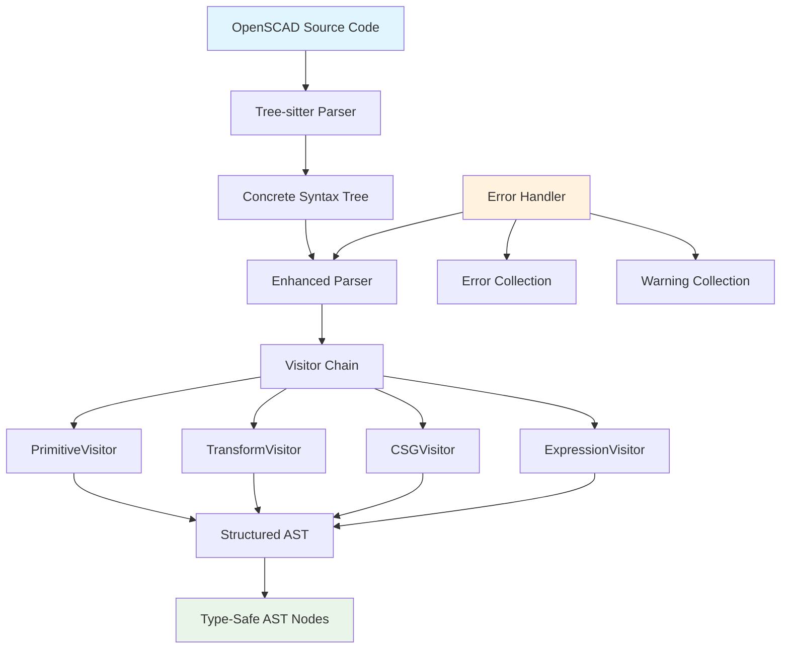
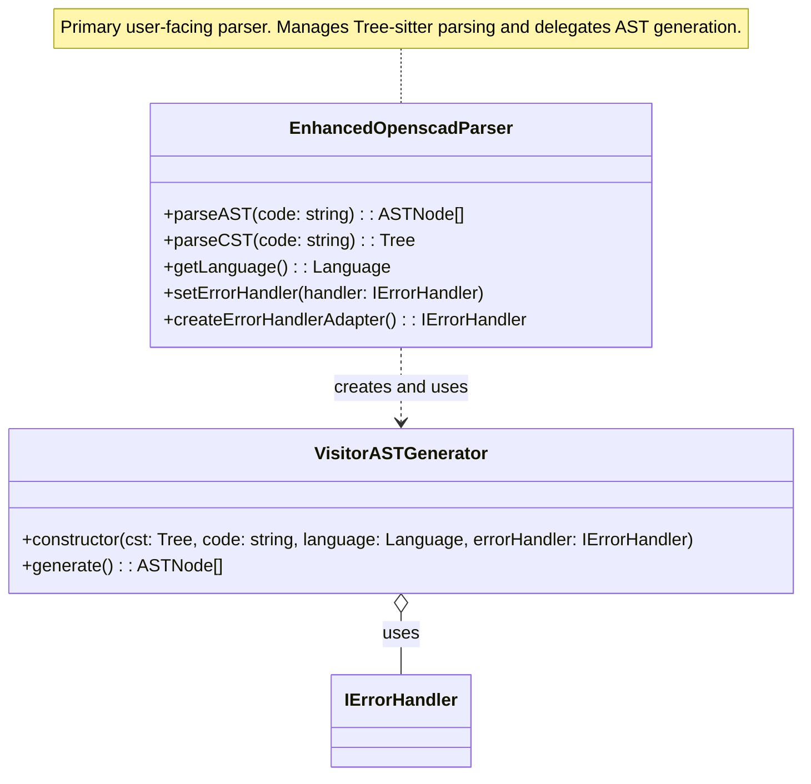
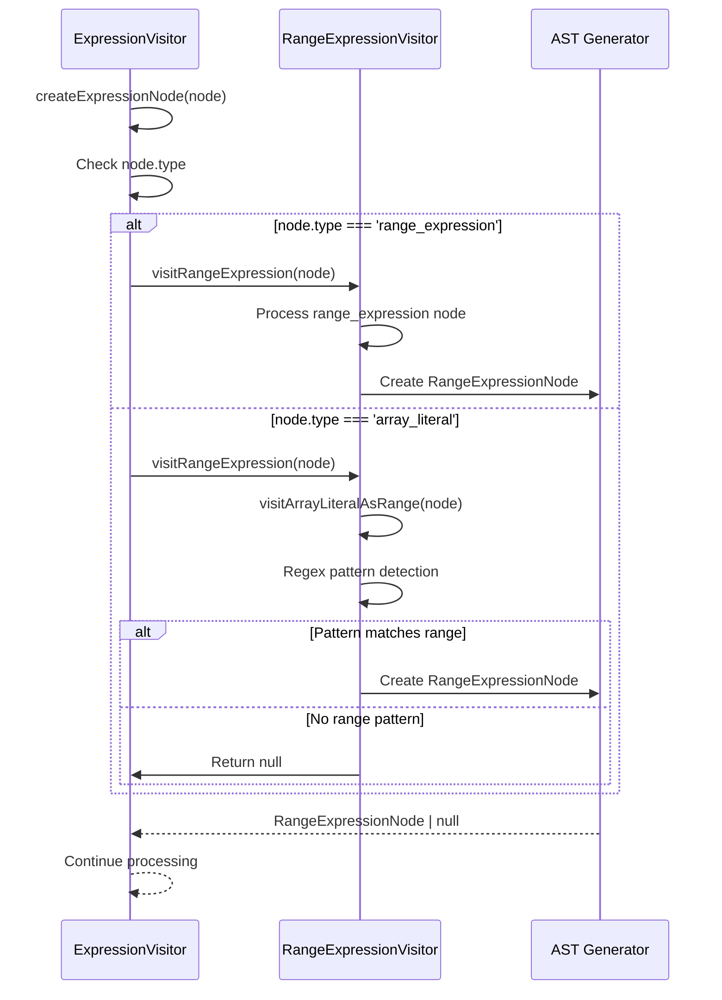
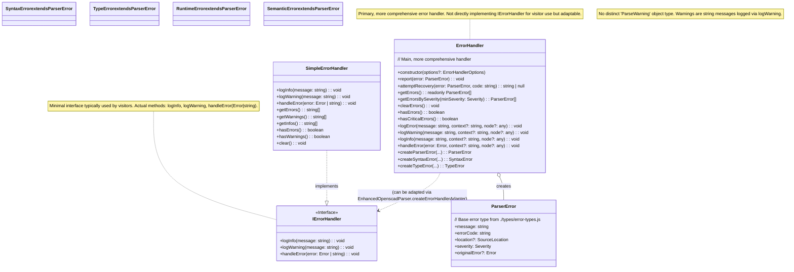
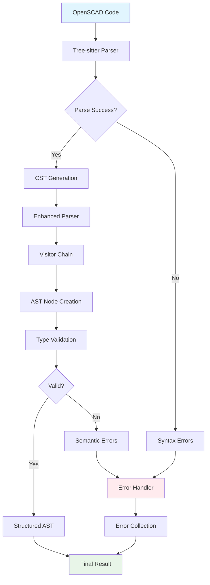
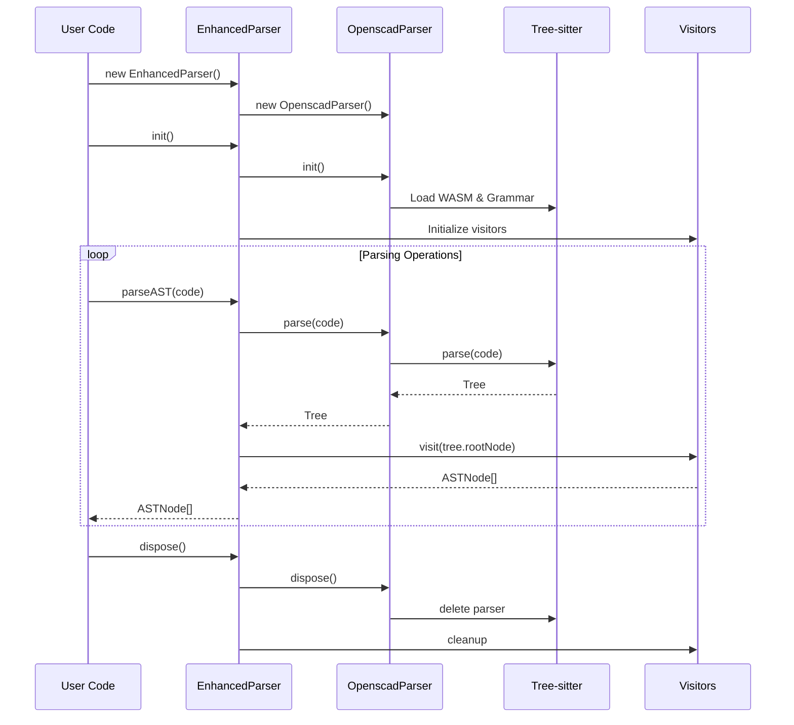
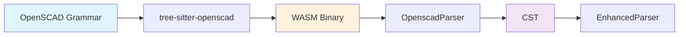
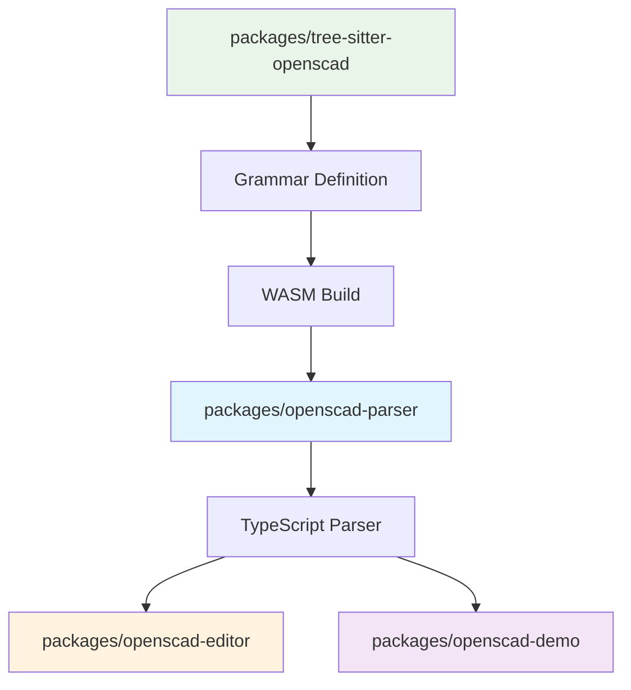
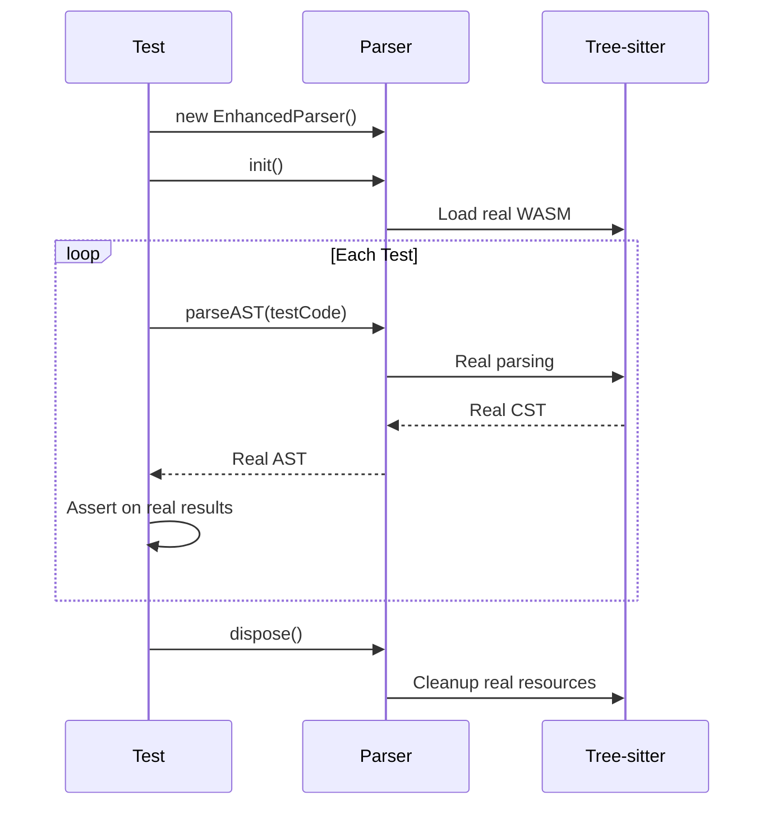

# Architecture

This document provides a comprehensive technical deep dive into the OpenSCAD Parser architecture, design patterns, and implementation details.

## Overview

The OpenSCAD Parser follows a layered architecture that separates concerns and provides flexibility for different use cases. The design emphasizes type safety, performance, and maintainability.

## High-Level Architecture



## Core Components

### 1. Core Parser and AST Generation



### 2. Visitor Pattern Classes

```mermaid
classDiagram
    class BaseASTVisitor {
        <<abstract>>
        +visitNode(node: CSTNode): ASTNode | null
        +visitStatement(node: CSTNode): ASTNode | null
        +createASTNodeForFunction(node: CSTNode, name: string, args: any[]): ASTNode | null
        #source: string
        #errorHandler: IErrorHandler
        +constructor(source: string, errorHandler: IErrorHandler)
    }
    class QueryVisitor {
        +constructor(source: string, tree: Tree, language: Language, compositeVisitor: CompositeVisitor, errorHandler: IErrorHandler)
        +visitNode(node: CSTNode): ASTNode | null
    }
    class CompositeVisitor {
        +visitors: ASTVisitor[]
        +visitNode(node: CSTNode): ASTNode | null
    }
    class ExpressionVisitor {
        +constructor(source: string, errorHandler: IErrorHandler)
        +dispatchSpecificExpression(node: CSTNode): ExpressionNode | ErrorNode | null
        +createExpressionNode(node: CSTNode): ExpressionNode | ErrorNode | null
        +visitRangeExpression(node: CSTNode): RangeExpressionNode | ErrorNode  // Delegates to RangeExpressionVisitor instance
    }
    class RangeExpressionVisitor {
        +constructor(parentVisitor: ExpressionVisitor, errorHandler: IErrorHandler)
        +visitRangeExpression(node: CSTNode): RangeExpressionNode | ErrorNode
        +visitNode(node: CSTNode): ASTNode | null
    }
    class PrimitiveVisitor { +constructor(source: string, errorHandler: IErrorHandler) }
    class TransformVisitor { +constructor(source: string, compositeVisitor: CompositeVisitor, errorHandler: IErrorHandler) }
    class CSGVisitor { +constructor(source: string, errorHandler: IErrorHandler) }
    class ModuleVisitor { +constructor(source: string, errorHandler: IErrorHandler) }
    class FunctionVisitor { +constructor(source: string, errorHandler: IErrorHandler) }
    class ControlStructureVisitor { +constructor(source: string, errorHandler: IErrorHandler) }
    class AssignStatementVisitor { +constructor(source: string, errorHandler: IErrorHandler) }
    class AssertStatementVisitor { +constructor(source: string, errorHandler: IErrorHandler) }
    class EchoStatementVisitor { +constructor(source: string, errorHandler: IErrorHandler) }
    class VariableVisitor { +constructor(source: string, errorHandler: IErrorHandler) }

    QueryVisitor --|> BaseASTVisitor
    CompositeVisitor --|> BaseASTVisitor
    ExpressionVisitor --|> BaseASTVisitor
    RangeExpressionVisitor --|> BaseASTVisitor
    PrimitiveVisitor --|> BaseASTVisitor
    TransformVisitor --|> BaseASTVisitor
    CSGVisitor --|> BaseASTVisitor
    ModuleVisitor --|> BaseASTVisitor
    FunctionVisitor --|> BaseASTVisitor
    ControlStructureVisitor --|> BaseASTVisitor
    AssignStatementVisitor --|> BaseASTVisitor
    AssertStatementVisitor --|> BaseASTVisitor
    EchoStatementVisitor --|> BaseASTVisitor
    VariableVisitor --|> BaseASTVisitor

    QueryVisitor o-- CompositeVisitor : uses
    CompositeVisitor o-- ExpressionVisitor : has-a (part of visitors list)
    CompositeVisitor o-- PrimitiveVisitor : has-a
    CompositeVisitor o-- TransformVisitor : has-a
    CompositeVisitor o-- CSGVisitor : has-a
    CompositeVisitor o-- ModuleVisitor : has-a
    CompositeVisitor o-- FunctionVisitor : has-a
    CompositeVisitor o-- ControlStructureVisitor : has-a
    CompositeVisitor o-- AssignStatementVisitor : has-a
    CompositeVisitor o-- AssertStatementVisitor : has-a
    CompositeVisitor o-- EchoStatementVisitor : has-a
    CompositeVisitor o-- VariableVisitor : has-a

    ExpressionVisitor o-- RangeExpressionVisitor : creates and uses
    note for VisitorASTGenerator "Orchestrates AST generation using QueryVisitor and CompositeVisitor."
```



### 3. Visitor Chain Processing



### 4. Error Handling System



### 5. Data Flow

#### Parsing Pipeline



### Memory Management



## Performance Characteristics

### Time Complexity

| Operation | Complexity | Notes |
|-----------|------------|-------|
| CST Parsing | O(n) | Linear with input size |
| AST Generation | O(n) | Single pass through CST |
| Node Lookup | O(1) | Direct access via type guards |
| Tree Traversal | O(n) | Visits each node once |
| Incremental Update | O(log n) | Tree-sitter incremental parsing |

### Space Complexity

| Component | Space Usage | Notes |
|-----------|-------------|-------|
| CST | O(n) | Preserves all syntax information |
| AST | O(k) | Where k < n (structured representation) |
| Error Collection | O(e) | Where e = number of errors |
| Parser State | O(1) | Constant overhead |

### Optimization Strategies

1. **Parser Reuse**: Reuse parser instances for multiple operations
2. **Incremental Parsing**: Use tree-sitter's incremental parsing for large files
3. **Lazy Evaluation**: Generate AST nodes only when needed
4. **Memory Pooling**: Reuse AST node objects where possible

## Design Patterns

### 1. Visitor Pattern

**Purpose**: Separate AST node processing logic from node structure

**Benefits**:
- Easy to add new operations without modifying node classes
- Supports different processing strategies
- Maintains type safety

**Implementation**:
```typescript
abstract class BaseASTVisitor {
  abstract visit(node: TreeSitter.SyntaxNode): ASTNode | null;
  
  protected visitChildren(node: TreeSitter.SyntaxNode): ASTNode[] {
    const results: ASTNode[] = [];
    for (let i = 0; i < node.childCount; i++) {
      const child = node.child(i);
      if (child) {
        const result = this.visit(child);
        if (result) results.push(result);
      }
    }
    return results;
  }
}
```

### 2. Chain of Responsibility

**Purpose**: Allow multiple visitors to process the same node

**Benefits**:
- Flexible processing pipeline
- Easy to add/remove processors
- Fail-safe delegation

### 3. Factory Pattern

**Purpose**: Create appropriate AST nodes based on CST node types

**Benefits**:
- Centralized node creation logic
- Type-safe node instantiation
- Easy to extend with new node types

### 4. Strategy Pattern

**Purpose**: Different error handling strategies

**Benefits**:
- Pluggable error handling
- Different strategies for different contexts
- Easy testing with mock handlers

## Integration Points

### Tree-sitter Integration



### Monorepo Integration



## Testing Architecture

### Real Parser Pattern

The library follows the "Real Parser Pattern" for testing:



**Benefits**:
- Tests real integration between components
- Catches actual parsing issues
- Provides confidence in production behavior
- No mock maintenance overhead

## Extension Points

### Custom Visitors

```typescript
class CustomVisitor extends BaseASTVisitor {
  visit(node: TreeSitter.SyntaxNode): ASTNode | null {
    // Custom processing logic
    switch (node.type) {
      case 'custom_construct':
        return this.createCustomNode(node);
      default:
        return super.visit(node);
    }
  }
  
  private createCustomNode(node: TreeSitter.SyntaxNode): CustomNode {
    // Custom node creation
  }
}
```

### Custom Error Handlers

```typescript
class LoggingErrorHandler implements IErrorHandler {
  handleError(error: ParseError): void {
    console.error(`Parse error: ${error.message}`);
    // Send to logging service
  }
  
  handleWarning(warning: ParseWarning): void {
    console.warn(`Parse warning: ${warning.message}`);
  }
  
  // ... other methods
}
```

### Custom AST Nodes

```typescript
interface CustomNode extends ASTNode {
  type: 'custom';
  customProperty: string;
}

function isCustomNode(node: ASTNode): node is CustomNode {
  return node.type === 'custom';
}
```

## Future Considerations

### Scalability

1. **Streaming Parser**: For very large files
2. **Worker Thread Support**: Offload parsing to web workers
3. **Caching**: Cache parsed results for unchanged code
4. **Lazy Loading**: Load grammar modules on demand

### Extensibility

1. **Plugin System**: Allow third-party extensions
2. **Custom Grammars**: Support for OpenSCAD extensions
3. **Multiple Backends**: Support different parsing engines
4. **Language Server**: IDE integration capabilities
