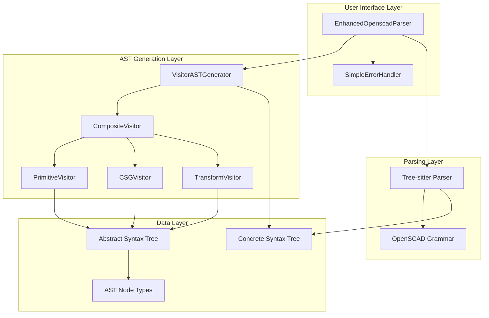
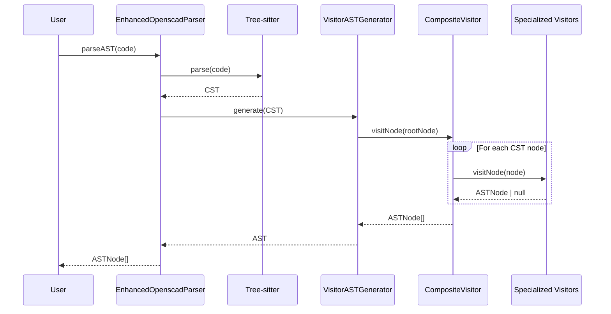
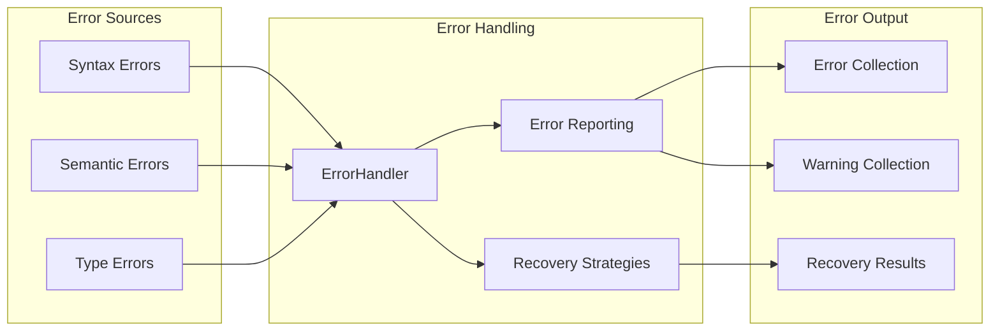
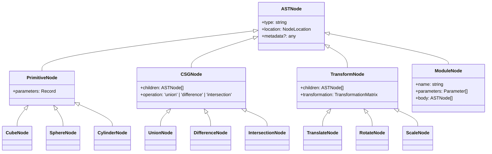

# Architecture Overview

This document provides a comprehensive overview of the OpenSCAD Parser architecture, including system design, data flow, and key components.

## High-Level Architecture

The OpenSCAD Parser follows a layered architecture with clear separation of concerns:

## Core Components

### 1. EnhancedOpenscadParser

The main entry point for the parser system. Provides a clean API for parsing OpenSCAD code.

**Responsibilities:**
- Initialize Tree-sitter parser with OpenSCAD grammar
- Coordinate between CST parsing and AST generation
- Manage error handling and reporting
- Provide both CST and AST parsing capabilities

### 2. VisitorASTGenerator

Orchestrates the AST generation process using the visitor pattern.

**Responsibilities:**
- Traverse the CST generated by Tree-sitter
- Coordinate visitor delegation through CompositeVisitor
- Manage AST node creation and assembly
- Handle error propagation during AST generation

### 3. Visitor System

A sophisticated visitor pattern implementation with specialized visitors:

#### CompositeVisitor
- **Role**: Central dispatcher for visitor delegation
- **Pattern**: Composite pattern for visitor coordination
- **Responsibility**: Route CST nodes to appropriate specialized visitors

#### PrimitiveVisitor
- **Handles**: Basic 3D and 2D primitives (cube, sphere, cylinder, etc.)
- **Extraction**: Parameter extraction and validation
- **Output**: Primitive AST nodes with typed parameters

#### CSGVisitor
- **Handles**: Boolean operations (union, difference, intersection)
- **Processing**: Child node collection and CSG tree construction
- **Output**: CSG operation nodes with child relationships

#### TransformVisitor
- **Handles**: Transformations (translate, rotate, scale, mirror)
- **Processing**: Transformation matrix calculation and child processing
- **Output**: Transform nodes with transformation data and children

## Data Flow

## Error Handling Architecture

## AST Node Type System

The parser generates a strongly-typed AST with the following node hierarchy:

## Performance Considerations

### Memory Management
- **Incremental Parsing**: Tree-sitter provides incremental parsing capabilities
- **Node Reuse**: AST nodes are created efficiently with minimal memory overhead
- **Garbage Collection**: Proper cleanup of Tree-sitter resources

### Parsing Performance
- **Lazy Evaluation**: AST generation only when requested
- **Visitor Optimization**: Specialized visitors avoid unnecessary processing
- **Caching Strategy**: Future implementation of intelligent caching

### Scalability
- **Large File Support**: Optimized for files up to 100KB+
- **Memory Efficiency**: Linear memory usage relative to input size
- **Processing Speed**: Sub-second parsing for typical OpenSCAD files

## Extension Points

The architecture provides several extension points for customization:

1. **Custom Visitors**: Add new visitor types for specialized processing
2. **AST Node Types**: Extend the AST node type system
3. **Error Strategies**: Implement custom error recovery strategies
4. **Parameter Extractors**: Add extractors for new OpenSCAD features

## Design Patterns Used

- **Visitor Pattern**: For AST generation and traversal
- **Composite Pattern**: For visitor coordination
- **Strategy Pattern**: For error handling strategies
- **Factory Pattern**: For AST node creation
- **Adapter Pattern**: For error handler compatibility

## Future Architecture Considerations

- **Plugin System**: Extensible plugin architecture for custom processing
- **Streaming Parser**: Support for streaming large files
- **Parallel Processing**: Multi-threaded parsing for large codebases
- **Language Server**: Integration with language server protocol
